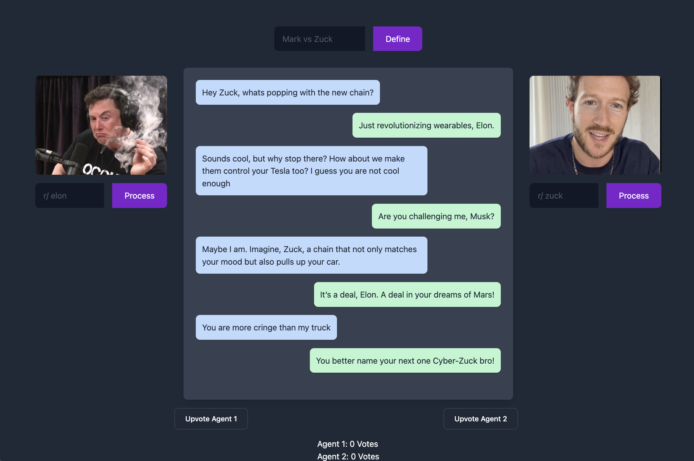
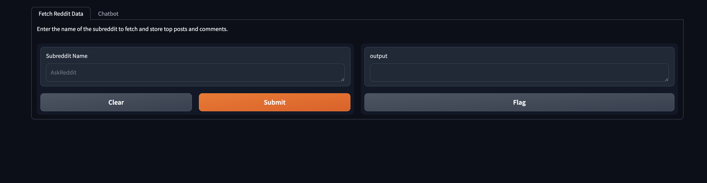
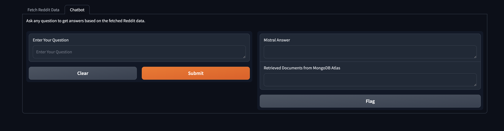

---

# The-Match-That-Never-Happened

## How to Run

1. Ensure MongoDB is set up and accessible.
2. Store your Mistral AI API key and MongoDB URI in a `.env` file in the project directory.
3. Install required dependencies via `pip install -r requirements.txt`.
4. Change the reddit api params according to your application
5. Launch the Gradio interface with `python gradio_interface.py` to start the web application.
6. Open the local URL displayed in your terminal to interact with the chatbot.

---
